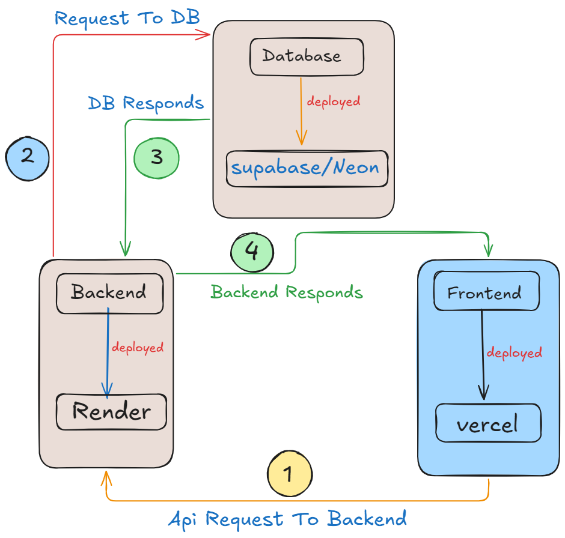

# Spendora

Spendora is a personal finance tracker built around a dashboard-first workflow for expenses, income, categories, and analytics.



_System Architecture: the frontend sends API requests to the backend, the backend talks to the database, and responses flow back to the frontend for rendering._

## Highlights

Spendora is now tuned for a cleaner product story and a more realistic platform summary:

- Session-based authentication with protected dashboard routes
- Transaction, income, and category management in one flow
- Analytics views for trends, distributions, and monthly insights
- Responsive layout with sidebar, mobile menu, and modal-driven forms
- API documentation and health endpoints on the backend
- SPA deployment support through Vercel rewrites

## What It Does

- Track expenses with list, detail, edit, and delete flows
- Add and review income entries alongside expense data
- Organize spending with custom categories
- Explore dashboard insights such as income vs expense trends, category distribution, and monthly summaries
- View recent activity and account details from a dedicated profile screen
- Sign in, sign up, and access protected pages through session-aware routing

## Current Stack

- Frontend: React 19, TypeScript, Vite, React Router, Redux Toolkit, React Redux
- UI and charts: Tailwind CSS 4, Chart.js, react-chartjs-2, react-hot-toast
- Backend: Node.js, Express 5, PostgreSQL, express-session, bcryptjs, CSRF protection
- Deployment: Vercel frontend rewrites with a hosted backend API

## Updated Achievements

The project now reflects a more credible implementation-focused set of wins:

- Protected dashboard architecture with route-level session gating
- Dedicated transaction, category, and analytics screens instead of a single monolithic page
- Backend API docs exposed at `/api/v1/docs`
- Health check endpoint at `/api/v1/status`
- Vercel rewrites configured for SPA navigation and API proxying
- CORS, CSRF, and rate limiting wired into the backend for safer request handling

## Routes

Frontend routes:

- `/welcome` - landing page
- `/signin` - sign-in page
- `/signup` - registration page
- `/` - protected dashboard shell
- `/transactions` - transaction management
- `/transactions/tnx-details/:id` - transaction detail view
- `/categories` - category management
- `/analytics` - charts and insights
- `/me` - account page
- `*` - fallback empty state

Backend routes:

- `/api/v1/auth` - login, register, logout, session, and CSRF helpers
- `/api/v1/auth/me` - current user lookup
- `/api/v1/auth/sid` - current session id
- `/api/v1/auth/csrf` - CSRF token retrieval
- `/api/v1/transactions` - transaction feeds and summaries
- `/api/v1/transactions/expenses` - expense operations
- `/api/v1/transactions/incomes` - income operations
- `/api/v1/categories` - category CRUD
- `/api/v1/status/serverHealth` - server health
- `/api/v1/docs` - Swagger UI documentation

## Setup

### Prerequisites

- Node.js 18+
- npm
- PostgreSQL for the backend

### Frontend

```bash
cd frontend
npm install
npm run dev
```

### Backend

```bash
cd backend
npm install
npm start
```

### Production Build

```bash
cd frontend
npm run build
```

### Lint

```bash
cd frontend
npm run lint
```

## Environment

The backend expects environment values for session and database configuration, loaded from the appropriate `.env` file for the target environment. The frontend currently relies on the API proxy and deployment configuration defined in `frontend/vercel.json`.

## Project Layout

- `frontend/src/pages` - routed screens and layout containers
- `frontend/src/components` - reusable UI, navigation, forms, and state guards
- `frontend/src/charts` - analytics chart wrappers
- `frontend/src/store` - Redux store and API state
- `frontend/src/utils` - auth and helper utilities
- `backend/controllers` - request handlers for auth, categories, transactions, and health
- `backend/routes` - API route registration
- `backend/middleware` - CSRF and auth guards
- `backend/db` - database connection helpers and SQL references

## Deployment Notes

- Frontend rewrites send `/api/*` traffic to the hosted backend and route all other paths to `index.html`
- The backend is configured for CORS with local development origins and the production Vercel origin
- The API is served under `/api/v1`

## License

This project is licensed under MIT. See [LICENSE](LICENSE).
